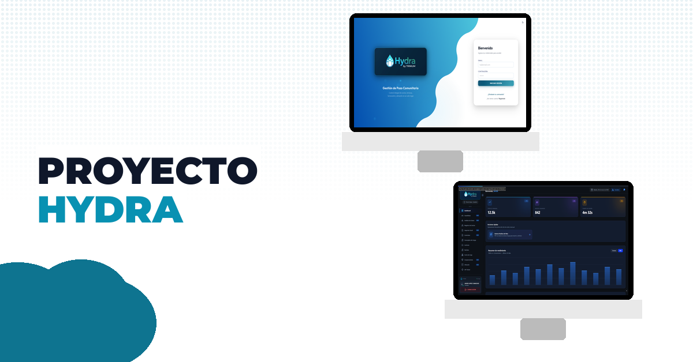
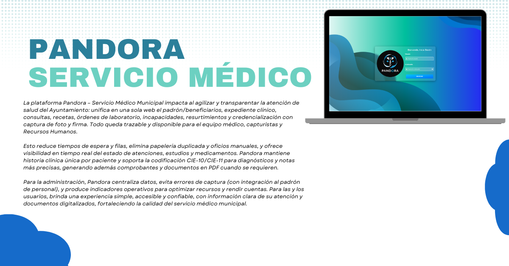
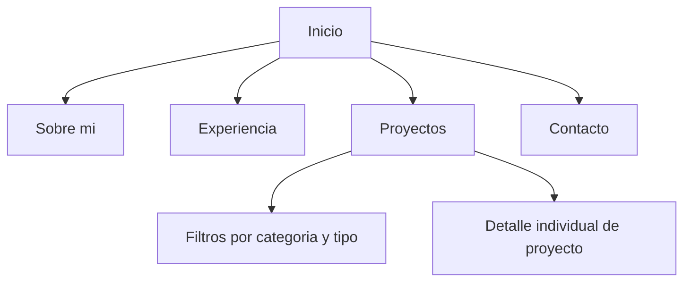

# Javier Lopez Camacho | Portfolio

<div align="center">

### Full-Stack Developer

Portafolio personal construido con **Next.js 16**, **React 19** y **Framer Motion** para mostrar proyectos web y móviles con enfoque en producto, UX y resultados reales.


<p>
  
  
  
  
  
</p>

</div>

---

## Vista general

Este proyecto es mi portafolio profesional. Presenta mi perfil como desarrollador full-stack, experiencia, proyectos destacados y formas de contacto dentro de una interfaz moderna, responsiva y con animaciones cuidadas.

### Lo más importante

- Landing page con hero visual, presentación personal y stack tecnológico.
- Catálogo de proyectos con filtros por categoría y tipo.
- Soporte para proyectos web, mobile y sitios corporativos.
- Modo oscuro, diseño responsivo y transiciones con `framer-motion`.
- Integración con `Vercel Analytics` y `Speed Insights`.

---

## Snapshot del proyecto

| Métrica | Valor |
| --- | --- |
| Framework principal | Next.js 16 |
| UI | React 19 + Tailwind CSS |
| Animación | Framer Motion |
| Proyectos cargados | 9 |
| Categorías | Freelance, Municipio, Personal, Empresarial |
| Tipos | Web Application, Website, Mobile Application |

### Preview visual

<p align="center">
  
  
</p>

### Distribución visual

```text
Web Applications   | ███ 3
Websites           | █ 1
Mobile Applications| █████ 5
```

```text
Freelance          | ███ 3
Municipio          | ███ 3
Personal           | ██ 2
Empresarial        | █ 1
```

---

## Arquitectura de navegación



---

## Stack

### Core

- `Next.js 16`
- `React 19`
- `React DOM 19`
- `Tailwind CSS`
- `Framer Motion`

### UI y experiencia

- `Lucide React`
- `Dark mode`
- `Responsive design`
- `Animaciones progresivas`

### Observabilidad y despliegue

- `Vercel Analytics`
- `Vercel Speed Insights`
- `Vercel`

---

## Proyectos destacados dentro del portafolio

| Proyecto | Tipo | Año | Enfoque |
| --- | --- | --- | --- |
| Hydra | Web Application | 2026 | ERP comunitario para pozo de agua |
| Assembly Management | Web Application | 2025 | Gestión de ensamblajes industriales |
| Motores Jordan | Website | 2025 | Sitio comercial orientado a conversión |
| Pandora | Web Application | 2025 | Gestión médica municipal |
| CUS Móvil | Mobile Application | 2025 | Trámites ciudadanos desde móvil |
| Atención Ciudadana | Mobile Application | 2025 | Captura de incidencias por voz |
| FinMaster | Mobile Application | 2024 | Finanzas personales |
| Nimbus | Mobile Application | 2023 | Operación logística empresarial |
| Smart LED | Mobile Application | 2023 | Control y monitoreo IoT |

---

## Estructura del proyecto

```bash
app/
  about/
  contact/
  experience/
  projects/
components/
data/
public/
  Banners/
  images/
```

---

## Objetivo del portafolio

Este sitio no busca solo listar tecnologías. Está diseñado para comunicar:

- experiencia construyendo software para gobierno, empresas y proyectos freelance;
- capacidad de trabajar tanto en **web** como en **mobile**;
- enfoque en productos con impacto operativo, no solo en interfaces bonitas;
- criterio visual para presentar proyectos de forma clara, moderna y profesional.

---

## Tecnologías que aparecen con más fuerza en el contenido

`Next.js` `Flutter` `SQL Server` `Firebase` `Tailwind CSS` `Google Maps` `Node.js` `PostgreSQL` `MongoDB` `MySQL` `Supabase` `React Native`

---

## Estado

```text
Diseño visual     ██████████ 100%
Contenido base    ██████████ 100%
Escalabilidad     ████████░░  80%
Iteración futura  ███████░░░  70%
```

---

## Contacto

Si este portafolio te interesa como referencia visual o técnica, puedes usarlo como base para explorar:

- presentación profesional en una sola página;
- catálogo filtrable de proyectos;
- mezcla de branding personal con enfoque de producto;
- portafolio orientado a clientes, reclutadores o colaboración freelance.
